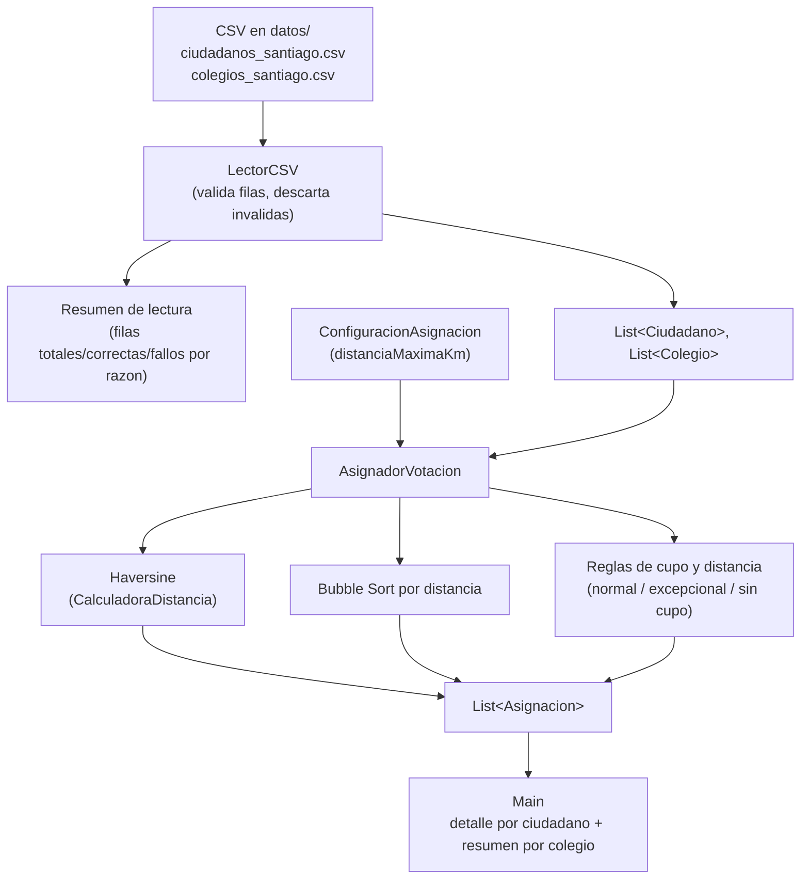

# Proyecto Solemne — Asignación de Ciudadanos a Locales de Votación

Programa en Java que simula la asignación de ciudadanos a locales de votación
(colegios) en Santiago, según cercanía geográfica y disponibilidad de cupos.
Desarrollado como proyecto solemne para el curso **ICIL012-11 — Fundamentos de
Programación**.

## Descripción del problema

Dado un listado de ciudadanos y un listado de locales de votación (cada uno
con coordenadas geográficas y una capacidad máxima de personas), el programa
debe asignar a cada ciudadano el local más adecuado siguiendo estas reglas:

1. **Asignación normal**: se asigna al colegio válido más cercano (con cupo
   disponible) que esté a **5 km o menos** de distancia.
2. **Asignación excepcional por distancia**: si ningún colegio a 5 km o menos
   tiene cupo, se relaja la restricción de distancia y se asigna al colegio
   más cercano que aún tenga cupo disponible, sin importar la distancia.
3. **Sin asignación**: si ningún colegio tiene cupo disponible, el ciudadano
   queda registrado sin local asignado.

La distancia entre un ciudadano y un colegio se calcula con la **fórmula de
Haversine**, que estima la distancia entre dos puntos geográficos (latitud y
longitud) sobre la superficie terrestre.

## Arquitectura y clases

El proyecto sigue un diseño orientado a objetos con responsabilidades
separadas:

| Clase | Responsabilidad |
|---|---|
| `Main` | Punto de entrada. Coordina lectura de datos, ejecuta la asignación y muestra los resultados por consola. No contiene lógica de negocio. |
| `LectorCSV` | Lee los archivos `.csv` de ciudadanos y colegios y los transforma en listas de objetos `Ciudadano` / `Colegio`. Valida cada fila por separado (campos obligatorios vs. opcionales, valores "comodín" como `N/A`/`S/D`/`-`/`?`, comillas dobles para campos con comas internas): una fila inválida se descarta e informa por consola sin abortar el resto del archivo. Al terminar, imprime un resumen con filas totales, correctas y el detalle de fallos por razón. |
| `Ciudadano` | Modelo de datos inmutable: representa a una persona a asignar (id, rut, nombre, comuna, latitud, longitud). Sin setters: se construye una sola vez desde el CSV y no cambia después. |
| `Colegio` | Modelo de datos: representa un local de votación (código, nombre, comuna, coordenadas, capacidad máxima y cantidad de asignados actuales). Controla sus propios cupos (`tieneCupo()`, `agregarCiudadano()`); no expone setters genéricos, ya que `agregarCiudadano()` es la única mutación válida. |
| `CalculadoraDistancia` | Utilidad estática que implementa la fórmula de Haversine para calcular distancia en km entre dos coordenadas. |
| `ColegioDistancia` | Clase auxiliar que empareja un `Colegio` con la distancia calculada hacia un ciudadano específico. |
| `ConfiguracionAsignacion` | Agrupa los parámetros configurables de la regla de negocio (actualmente, la distancia máxima de 5 km) en vez de dejarlos como constantes fijas dentro de `AsignadorVotacion`. |
| `AsignadorVotacion` | Contiene la lógica de negocio: recibe una `ConfiguracionAsignacion` en su constructor, calcula alternativas, las ordena por distancia (Bubble Sort) y aplica las reglas de asignación normal / excepcional / sin cupo. |
| `Asignacion` | Modelo de datos: resultado final de asignar (o no) un ciudadano a un colegio, con distancia y tipo de asignación. Define las constantes `NORMAL`, `EXCEPCIONAL_POR_DISTANCIA` y `SIN_ASIGNACION` para evitar comparar strings sueltos en otras clases. |

### Flujo general



## Datos de entrada

Los datos oficiales se leen desde la carpeta [`datos/`](datos/):

- **`ciudadanos_santiago.csv`**: columnas `id, rut, nombre, comuna, latitud, longitud`.
- **`colegios_santiago.csv`**: columnas `codigo, nombre, comuna, latitud, longitud, capacidad_maxima`.

Ambos archivos deben estar codificados en UTF-8 y usar coma como separador. `LectorCSV` acepta además:

- **Campos entre comillas dobles** con comas internas (ej. `"Liceo, Sede Centro"`), que no se dividen en columnas de más.
- **Valores "comodín"** (`N/A`, `S/D`, `-`, `?`, o vacío) en cualquier campo: en un campo obligatorio (`id`/`nombre`/`latitud`/`longitud` en Ciudadano; `codigo`/`nombre`/`latitud`/`longitud`/`capacidadMaxima` en Colegio) descartan la fila; en un campo opcional (`rut`, `comuna`) se completan con el valor por defecto `"SIN DATO"`.

En [`datos/pruebas_robustez/`](datos/pruebas_robustez/) hay 8 CSV adicionales (100 filas cada uno) usados exclusivamente por el test de robustez descrito más abajo — no se usan en la ejecución normal del programa.

## Requisitos

- **JDK 21** (Java SE 21). El proyecto está configurado explícitamente para
  este nivel de compilación tanto en Eclipse (`.classpath`,
  `.settings/org.eclipse.jdt.core.prefs`) como en IntelliJ IDEA (`.iml`,
  `.idea/misc.xml`).

## Cómo ejecutar

### Desde una IDE (Eclipse / IntelliJ IDEA)

1. Importar el proyecto (`File > Open` en IntelliJ, o `Import Existing
   Project` en Eclipse).
2. Asegurarse de que el proyecto use un SDK JDK 21 (ver sección de
   requisitos).
3. Ejecutar la clase `Main`.

### Desde la línea de comandos

Desde la raíz del proyecto:

```bash
javac -d bin src/*.java
java -cp bin Main
```

> El programa asume que se ejecuta desde la raíz del proyecto, ya que las
> rutas a los CSV (`datos/ciudadanos_santiago.csv` y
> `datos/colegios_santiago.csv`) están escritas como rutas relativas en
> `Main.java`.

## Pruebas de robustez de LectorCSV

`PruebaRobustezLectorCSV` es un test end-to-end con su propio `main()`, sin dependencias externas (no usa JUnit ni ningún framework, ya que el proyecto no tiene gestor de dependencias). No forma parte del flujo oficial: `Main` sigue leyendo únicamente `datos/ciudadanos_santiago.csv` y `datos/colegios_santiago.csv`.

Ejecuta `LectorCSV` contra los 8 archivos de `datos/pruebas_robustez/` (campos obligatorios vacíos, valores numéricos inválidos, delimitador incorrecto, y campos opcionales vacíos, tanto para ciudadanos como para colegios) y compara el resultado real contra un resultado esperado conocido de antemano.

Desde la raíz del proyecto:

```bash
javac -d bin src/*.java
java -cp bin PruebaRobustezLectorCSV
```

Termina con código de salida `0` si los 8 casos pasan, o `1` si alguno falla (imprime `[OK]`/`[FALLO]` por cada archivo).

## Salida esperada

El programa imprime dos secciones por consola:

1. **Detalle de asignación**: para cada ciudadano, el local asignado (o
   "SIN LOCAL DISPONIBLE"), la distancia en km y el tipo de asignación.
2. **Resumen final**: totales de asignaciones normales, excepcionales y sin
   asignar, además de la ocupación (cupos usados / capacidad máxima) de cada
   colegio.

## Manejo de errores

El manejo de errores ocurre en dos niveles:

- **Por fila, dentro de `LectorCSV`**: un campo obligatorio vacío, comodín o numéricamente inválido
  descarta solo esa fila (se informa por consola la línea y la razón) y la lectura continúa con la
  siguiente. Esto reemplazó un primer enfoque en el que un solo dato mal formado interrumpía la
  lectura del archivo completo.
- **A nivel de archivo, en `Main`**, con un único bloque `try/catch`:
  - `IOException`: archivo CSV inexistente o inaccesible.
  - `NumberFormatException`: se mantiene como red de seguridad adicional, aunque ya no debería
    dispararse en la práctica, porque `LectorCSV` valida cada valor numérico antes de convertirlo.
  - `Exception` (genérico): red de seguridad para cualquier error no previsto, evitando que el
    programa termine de forma abrupta.

## Estructura del repositorio

```
proyecto_solemne/
├── src/                          # Código fuente Java
│   ├── Main.java
│   ├── LectorCSV.java
│   ├── Ciudadano.java
│   ├── Colegio.java
│   ├── CalculadoraDistancia.java
│   ├── ColegioDistancia.java
│   ├── ConfiguracionAsignacion.java
│   ├── AsignadorVotacion.java
│   ├── Asignacion.java
│   └── PruebaRobustezLectorCSV.java   # Test e2e de LectorCSV (no forma parte del flujo oficial)
├── datos/                        # Archivos CSV de entrada
│   ├── ciudadanos_santiago.csv
│   ├── colegios_santiago.csv
│   └── pruebas_robustez/         # 8 CSV de prueba usados solo por PruebaRobustezLectorCSV
├── bin/                          # Clases compiladas (salida de build)
├── .classpath / .project / .settings/   # Configuración Eclipse
└── proyecto_solemne.iml / .idea/        # Configuración IntelliJ IDEA
```
